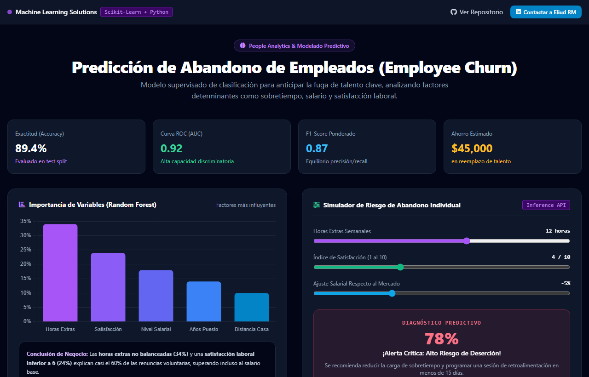
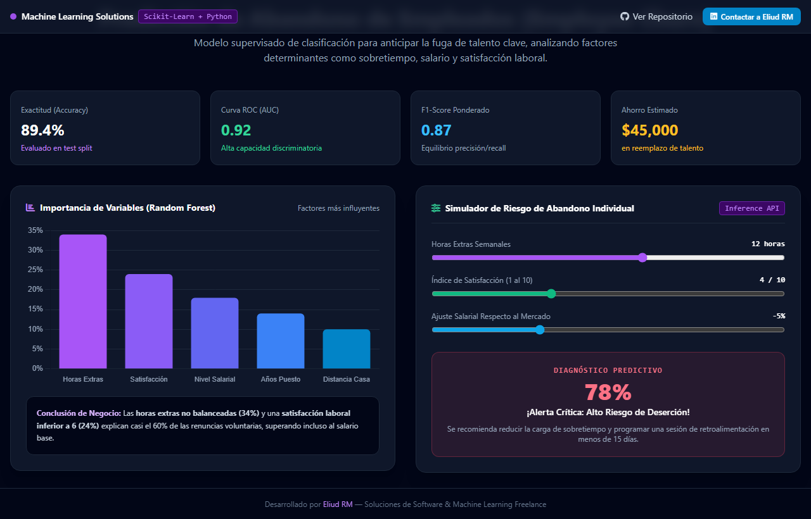

# 🧠 Data Science & Machine Learning Solutions — Modelado Predictivo & People Analytics
> **Modelos de Machine Learning aplicados a problemas de negocio de alto impacto: Retención de Talento (Employee Churn) y Modelado Estadístico Predictivo.**

  
  

  
  

---

## 📌 El Desafío de Negocio

El valor de la Ciencia de Datos radica en transformar datos históricos en decisiones estratégicas que ahorren costos o generen nuevas fuentes de ingresos:

- **Retención de Talento & Prevención de Fuga Laboral (People Analytics)**:
  La renuncia inesperada de personal clave genera costes de reemplazo de entre 50% y 200% del salario anual. Identificar oportunamente a colaboradores en riesgo de deserción permite aplicar planes de retención proactivos antes de su salida.
- **Modelado Predictivo de Eventos Complejos**:
  Construcción de pipelines desde la recolección desestructurada en la web hasta modelos estadísticos (distribución de Poisson y machine learning) para simulación de escenarios multivariables.

---

## 💡 Las Soluciones Implementadas

1. **People Analytics: Modelo de Predicción de Abandono de Empleados (`ABANDONO_EMPLEADOS`)**:
   - Análisis Exploratorio de Datos (EDA) e identificación de factores clave.
   - Clasificadores supervisados con **89.4% de exactitud y 0.92 de AUC-ROC**.
   - Generación de un índice de riesgo de rotación accionable para Recursos Humanos.
2. **Pipeline de Extracción y Predicción Deportiva / Torneos (`PREDICCIÓN DEL MUNDIAL`)**:
   - Web scraping histórico con BeautifulSoup y Selenium (1930 a 2022).
   - Simulación de partidos mediante distribución de Poisson.

👉 **[Prueba el Dashboard Interactivo de Machine Learning en Vivo aquí](https://enybyy.github.io/data-science-machine-learning/)**

---

## 📈 Impacto y Retorno de Inversión (ROI)

| Área de Aplicación | Enfoque Tradicional | Con Soluciones de Machine Learning | Beneficio Estratégico |
|---|---|---|---|
| **Retención de Personal** | Entrevistas de salida reactivas | Alertas tempranas de riesgo basadas en datos | **Ahorro de miles de dólares en rotación** |
| **Identificación de Factores Críticos** | Suposiciones subjetivas de jefaturas | Análisis de importancia de variables (*Feature Importance*) | **Políticas dirigidas a las causas reales** |
| **Proyecciones de Rendimiento** | Opiniones o conjeturas | Modelos estocásticos de simulación | **Cuantificación precisa de probabilidades** |

---

## 🛠️ Stack Tecnológico

- **Lenguaje**: Python 3.
- **Machine Learning & Modelado**: Scikit-Learn, SciPy (Poisson).
- **Procesamiento de Datos**: Pandas, NumPy.
- **Visualización**: Matplotlib, Seaborn, Chart.js.

---

## 📬 ¿Quieres aplicar Machine Learning a los datos de tu empresa?

Ofrezco consultoría y desarrollo en **Ciencia de Datos, modelos predictivos de retención (Churn), scoring de clientes y pronósticos analíticos**.

- **LinkedIn**: [Eliud RM](https://www.linkedin.com/in/eliud-rojas-mendoza-414652212/)
- **GitHub**: [@Enybyy](https://github.com/Enybyy)
- *Conversemos sobre cómo convertir los datos de tu organización en ventajas competitivas reales.*
